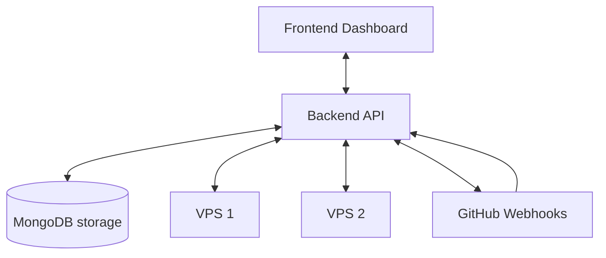

# Architecture Overview

Pulse is designed as a modern, agentless management platform for deploying and analyzing applications on remote Linux VPS environments.

## System Components

- **Frontend (React + Vite)**: A highly interactive, real-time dashboard powered by Material UI and WebSockets.
- **Backend (Node.js + Express)**: Provides REST APIs, socket connections, caching, and background job scheduling.
- **Database (MongoDB)**: Stores configurations, deployment metadata, project states, and secrets.
- **Agentless Execution**: Pulse communicates with your VPS entirely via **SSH**. You do _not_ need to install a proprietary agent daemon.

## High-Level Architecture

## Security

Security is paramount in an agentless deployment system:

1. **Never expose the internal daemon.** Pulse talks locally via SSH to tools like Docker and PM2.
2. **Key-based Authentication.** Use Ed25519 SSH keys for strongest security.
3. **Encrypted secrets.** Project environment variables mapping is secured at rest.
